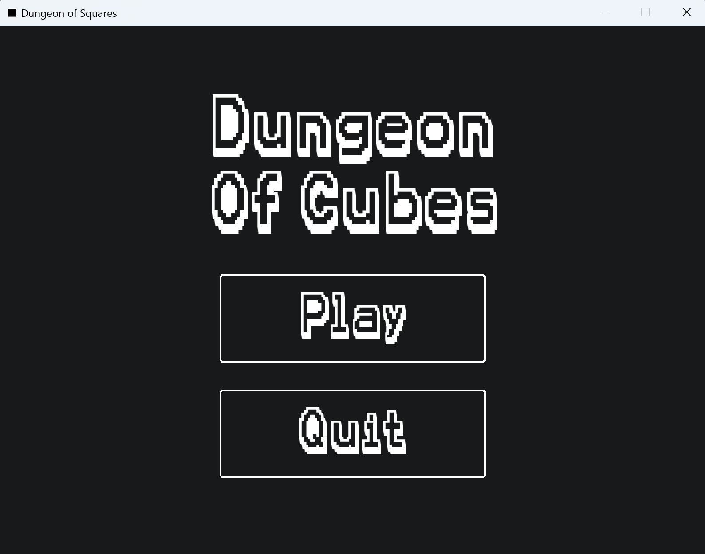
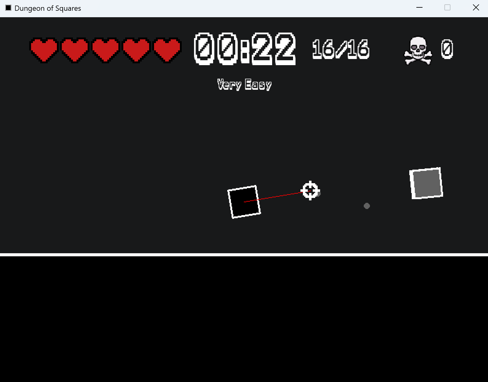
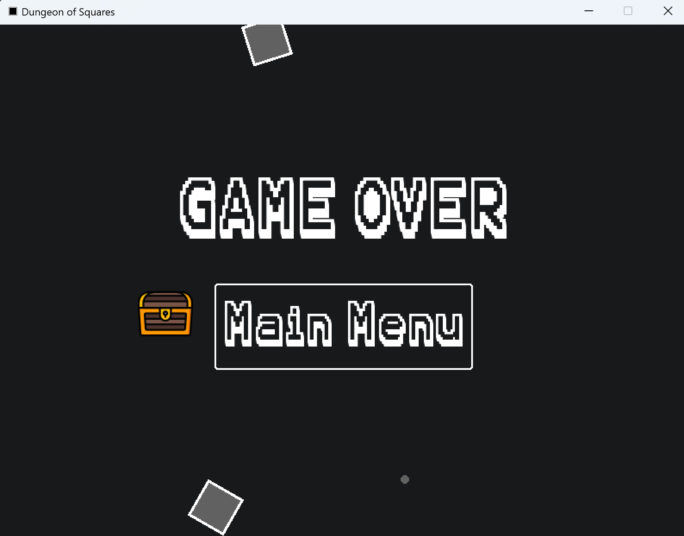

# Dungeon of Cubes (Not Complete)
This is a simple cube based game. You must shoot and defeat all the other cubes and survive as log as possible

The control keys are:
- "wasd"
- "mouse"

Used libraries:
- pygame
- random
- math
- sys

## Setup
Pre-requirements:
python 3.9 >

## Download
[game.zip](https://github.com/user-attachments/files/17468418/game.zip)

## Limitations
- Enemies go through objects
- Player collision with objects/walls is not smooth
- Still working on boids for the enemies (A way for the enemies to seperate from eachother)

## Screenshots

